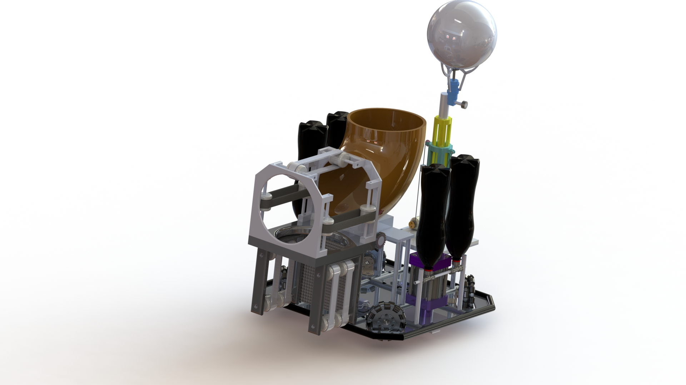

# ROBOCON 2025 CAD Design – DTU Altair Team

This repository contains the CAD models and design renders for the DTU Altair Team's ROBOCON 2025 robot.  
Designed in SolidWorks for the world robotics championship.

## Preview of Designs

### Full CAD Assembly

---

## Contents
- **Chassis Design** – Lightweight, stable base for robot.  
- **Manipulator & Gripper** – Optimized for object handling.  
- **Render Images** – Visualizations of the CAD assembly.  

## Tools Used
- SolidWorks  
- Ansys (Simulation)  
- MATLAB  

## Contributors
- **Sanjeev** – Mechanical Head, DTU Altair
